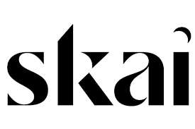
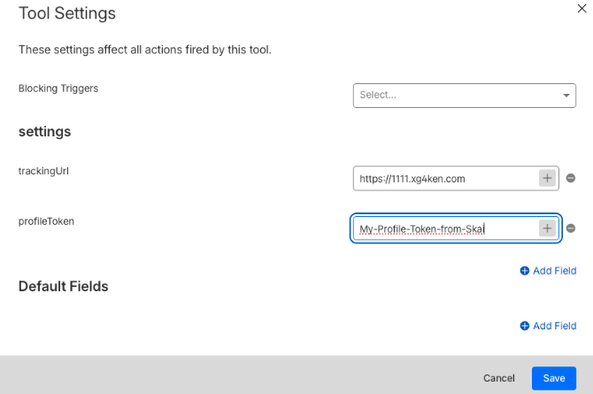

# Skai Zaraz Custom Managed Component



## 📦 About

This Managed Component tracks user clicks and conversions for Skai. It sends event data to Skai’s tracking endpoint, enabling advanced analytics and conversion attribution.

## Documentation

Managed Components docs are published at **https://managedcomponents.dev** .

Find out more about Managed Components [here](https://blog.cloudflare.com/zaraz-open-source-managed-components-and-webcm/) for inspiration and motivation details.

[](./LICENSE)
[](./CONTRIBUTING.md)
[](https://github.com/prettier/prettier)

## 🛠️ Building Locally

1. Make sure you're running node version >=18.
2. Install dependencies:
   ```bash
   npm install
   ```
3. Build the component:
   ```bash
   npm run build
   ```
   The output will be in the `dist` folder.

## 🚀 Deploying to Cloudflare

Use the following command to deploy the built component as a Cloudflare Worker:
```bash
npx managed-component-to-cloudflare-worker ./dist/index.js skai-zaraz ./wrangler.toml
```
This will package and deploy your component using the configuration in `wrangler.toml`.

## 🏷️ Installing in Cloudflare Tag Setup

To use this as a custom Managed Component in Cloudflare Zaraz:

1. Go to Cloudflare Zaraz Tag setup.
2. Add a new Custom Managed Component.
3. Upload or reference your deployed Worker.
4. Fill in the required fields before activation:
   - `trackingUrl`: The Skai endpoint to send tracking data.
   - `profileToken`: Your Skai profile token for authentication.

These fields must be configured for the component to function correctly.

### 🔧 Example Fields Configuration in Zaraz

Below is an example of how the fields configuration looks inside the Zaraz UI when setting up this custom Managed Component:



## 💻 Example: Triggering a Purchase Event in the Browser

Below is an example of how to trigger an e-commerce conversion event using Zaraz from the browser:

> **Note:** The conversion type Skai receives is determined by the Zaraz e-commerce event name you use (for example, `Order Completed` in this snippet). For the full list of supported e-commerce event names, refer to the official Zaraz E-commerce documentation. You can override the inferred conversion type by passing an explicit `conversionType` field, as shown below.

```javascript
function triggerPurchase() {
    const orderId = 'ORD-' + Math.floor(Math.random() * 10000);
    // Use the Standard E-commerce API
    if (window.zaraz) {
        window.zaraz.ecommerce('Order Completed', {
            checkout_id: orderId,
            convertionType:"Shlomic Conversion"
            total: 29.99,
            currency: 'USD',
            products: [
                {
                    product_id: '998877',
                    sku: 'RED-TSHIRT-M',
                    name: 'Red T-Shirt',
                    price: 29.99,
                    quantity: 1
                }
            ]
        });

        console.log('Client: Sent zaraz.ecommerce("Order Completed")');
        alert('Order Completed event sent! Check Server Logs.');
    } else {
        alert('Zaraz not loaded');
    }
}
```

## 📝 License

Licensed under the [Apache License](./LICENSE).
